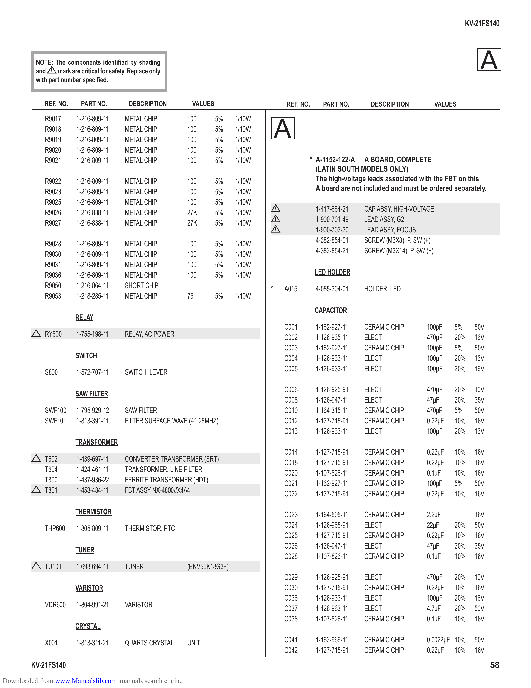

                                                                                                                                                              KV-21FS140

          NOTE: The components identified by shading
          and ! mark are critical for safety. Replace only
          with part number specified.
                                                                                                                                                                  A
              REF. NO.     PART NO.          DESCRIPTION         VALUES                         REF. NO.     PART NO.       DESCRIPTION              VALUES

              R9017      1-216-809-11       METAL CHIP          100       5%    1/10W
              R9018
              R9019
                         1-216-809-11
                         1-216-809-11
                                            METAL CHIP
                                            METAL CHIP
                                                                100
                                                                100
                                                                          5%
                                                                          5%
                                                                                1/10W
                                                                                1/10W
                                                                                            A
              R9020      1-216-809-11       METAL CHIP          100       5%    1/10W
              R9021      1-216-809-11       METAL CHIP          100       5%    1/10W                  * A-1152-122-A A BOARD, COMPLETE
                                                                                                         (LATIN SOUTH MODELS ONLY)
              R9022      1-216-809-11       METAL CHIP          100       5%    1/10W                    The high-voltage leads associated with the FBT on this
              R9023      1-216-809-11       METAL CHIP          100       5%    1/10W                    A board are not included and must be ordered separately.
              R9025      1-216-809-11       METAL CHIP          100       5%    1/10W
              R9026      1-216-838-11       METAL CHIP          27K       5%    1/10W
                                                                                            !              1-417-664-21   CAP ASSY, HIGH-VOLTAGE
              R9027      1-216-838-11       METAL CHIP          27K       5%    1/10W
                                                                                            !              1-900-701-49   LEAD ASSY, G2
                                                                                            !              1-900-702-30   LEAD ASSY, FOCUS
              R9028      1-216-809-11       METAL CHIP          100       5%    1/10W                      4-382-854-01   SCREW (M3X8), P, SW (+)
              R9030      1-216-809-11       METAL CHIP          100       5%    1/10W                      4-382-854-21   SCREW (M3X14), P, SW (+)
              R9031      1-216-809-11       METAL CHIP          100       5%    1/10W
              R9036      1-216-809-11       METAL CHIP          100       5%    1/10W                      LED HOLDER
              R9050      1-216-864-11       SHORT CHIP                                  *       A015       4-055-304-01   HOLDER, LED
              R9053      1-218-285-11       METAL CHIP          75        5%    1/10W
                                                                                                           CAPACITOR
                         RELAY
                                                                                                C001       1-162-927-11   CERAMIC CHIP         100pF      5%    50V
          !   RY600      1-755-198-11       RELAY, AC POWER                                     C002       1-126-935-11   ELECT                470µF      20%   16V
                                                                                                C003       1-162-927-11   CERAMIC CHIP         100pF      5%    50V
                         SWITCH                                                                 C004       1-126-933-11   ELECT                100µF      20%   16V
              S800       1-572-707-11       SWITCH, LEVER                                       C005       1-126-933-11   ELECT                100µF      20%   16V

                                                                                                C006       1-126-925-91   ELECT                470µF      20%   10V
                         SAW FILTER
                                                                                                C008       1-126-947-11   ELECT                47µF       20%   35V
              SWF100     1-795-929-12       SAW FILTER                                          C010       1-164-315-11   CERAMIC CHIP         470pF      5%    50V
              SWF101     1-813-391-11       FILTER,SURFACE WAVE (41.25MHZ)                      C012       1-127-715-91   CERAMIC CHIP         0.22µF     10%   16V
                                                                                                C013       1-126-933-11   ELECT                100µF      20%   16V
                         TRANSFORMER
                                                                                                C014       1-127-715-91   CERAMIC CHIP         0.22µF     10%   16V
          !   T602       1-439-697-11       CONVERTER TRANSFORMER (SRT)                         C018       1-127-715-91   CERAMIC CHIP         0.22µF     10%   16V
              T604       1-424-461-11       TRANSFORMER, LINE FILTER                            C020       1-107-826-11   CERAMIC CHIP         0.1µF      10%   16V
              T800       1-437-936-22       FERRITE TRANSFORMER (HDT)                           C021       1-162-927-11   CERAMIC CHIP         100pF      5%    50V
          !   T801       1-453-484-11       FBT ASSY NX-4800//X4A4                              C022       1-127-715-91   CERAMIC CHIP         0.22µF     10%   16V

                         THERMISTOR                                                             C023       1-164-505-11   CERAMIC CHIP         2.2µF            16V
              THP600     1-805-809-11       THERMISTOR, PTC                                     C024       1-126-965-91   ELECT                22µF       20%   50V
                                                                                                C025       1-127-715-91   CERAMIC CHIP         0.22µF     10%   16V
                         TUNER                                                                  C026       1-126-947-11   ELECT                47µF       20%   35V
                                                                                                C028       1-107-826-11   CERAMIC CHIP         0.1µF      10%   16V
          !   TU101      1-693-694-11       TUNER               (ENV56K18G3F)
                                                                                                C029       1-126-925-91   ELECT                470µF      20%   10V
                         VARISTOR                                                               C030       1-127-715-91   CERAMIC CHIP         0.22µF     10%   16V
                                                                                                C036       1-126-933-11   ELECT                100µF      20%   16V
              VDR600     1-804-991-21       VARISTOR                                            C037       1-126-963-11   ELECT                4.7µF      20%   50V
                                                                                                C038       1-107-826-11   CERAMIC CHIP         0.1µF      10%   16V
                         CRYSTAL

              X001       1-813-311-21       QUARTS CRYSTAL      UNIT                            C041       1-162-966-11   CERAMIC CHIP         0.0022µF 10%     50V
                                                                                                C042       1-127-715-91   CERAMIC CHIP         0.22µF 10%       16V
        KV-21FS140                                                                                                                                                    58
Downloaded from www.Manualslib.com manuals search engine
