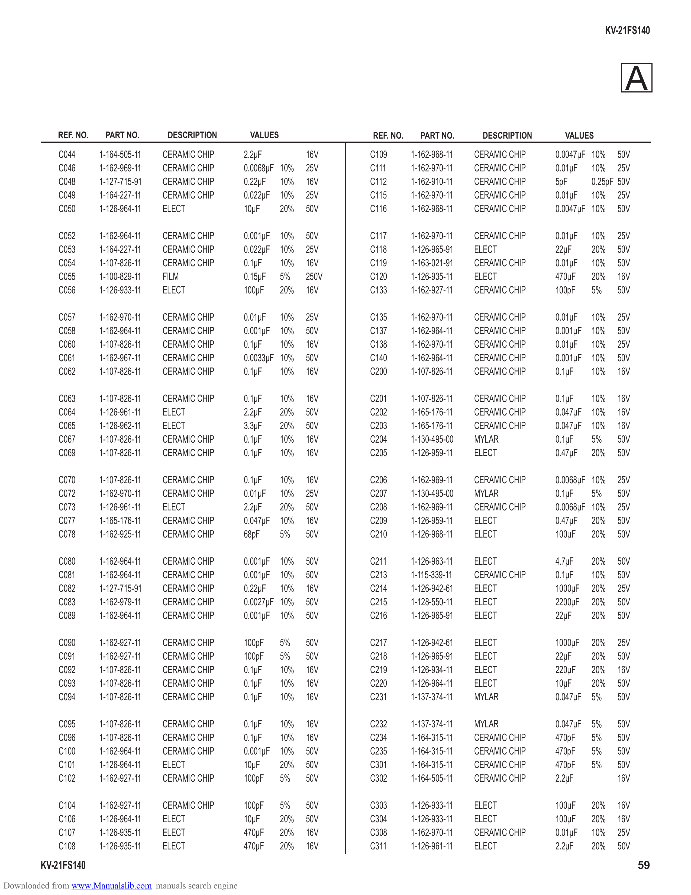

                                                                                                                                          KV-21FS140

                                                                                                                                              A
             REF. NO.    PART NO.       DESCRIPTION         VALUES                REF. NO.     PART NO.      DESCRIPTION     VALUES

             C044       1-164-505-11   CERAMIC CHIP        2.2µF           16V    C109       1-162-968-11   CERAMIC CHIP   0.0047µF 10% 50V
             C046       1-162-969-11   CERAMIC CHIP        0.0068µF 10%    25V    C111       1-162-970-11   CERAMIC CHIP   0.01µF 10% 25V
             C048       1-127-715-91   CERAMIC CHIP        0.22µF 10%      16V    C112       1-162-910-11   CERAMIC CHIP   5pF      0.25pF 50V
             C049       1-164-227-11   CERAMIC CHIP        0.022µF 10%     25V    C115       1-162-970-11   CERAMIC CHIP   0.01µF 10% 25V
             C050       1-126-964-11   ELECT               10µF     20%    50V    C116       1-162-968-11   CERAMIC CHIP   0.0047µF 10% 50V

             C052       1-162-964-11   CERAMIC CHIP        0.001µF   10%   50V    C117       1-162-970-11   CERAMIC CHIP   0.01µF    10%    25V
             C053       1-164-227-11   CERAMIC CHIP        0.022µF   10%   25V    C118       1-126-965-91   ELECT          22µF      20%    50V
             C054       1-107-826-11   CERAMIC CHIP        0.1µF     10%   16V    C119       1-163-021-91   CERAMIC CHIP   0.01µF    10%    50V
             C055       1-100-829-11   FILM                0.15µF    5%    250V   C120       1-126-935-11   ELECT          470µF     20%    16V
             C056       1-126-933-11   ELECT               100µF     20%   16V    C133       1-162-927-11   CERAMIC CHIP   100pF     5%     50V

             C057       1-162-970-11   CERAMIC CHIP        0.01µF 10%      25V    C135       1-162-970-11   CERAMIC CHIP   0.01µF    10%    25V
             C058       1-162-964-11   CERAMIC CHIP        0.001µF 10%     50V    C137       1-162-964-11   CERAMIC CHIP   0.001µF   10%    50V
             C060       1-107-826-11   CERAMIC CHIP        0.1µF    10%    16V    C138       1-162-970-11   CERAMIC CHIP   0.01µF    10%    25V
             C061       1-162-967-11   CERAMIC CHIP        0.0033µF 10%    50V    C140       1-162-964-11   CERAMIC CHIP   0.001µF   10%    50V
             C062       1-107-826-11   CERAMIC CHIP        0.1µF    10%    16V    C200       1-107-826-11   CERAMIC CHIP   0.1µF     10%    16V

             C063       1-107-826-11   CERAMIC CHIP        0.1µF     10%   16V    C201       1-107-826-11   CERAMIC CHIP   0.1µF     10%    16V
             C064       1-126-961-11   ELECT               2.2µF     20%   50V    C202       1-165-176-11   CERAMIC CHIP   0.047µF   10%    16V
             C065       1-126-962-11   ELECT               3.3µF     20%   50V    C203       1-165-176-11   CERAMIC CHIP   0.047µF   10%    16V
             C067       1-107-826-11   CERAMIC CHIP        0.1µF     10%   16V    C204       1-130-495-00   MYLAR          0.1µF     5%     50V
             C069       1-107-826-11   CERAMIC CHIP        0.1µF     10%   16V    C205       1-126-959-11   ELECT          0.47µF    20%    50V

             C070       1-107-826-11   CERAMIC CHIP        0.1µF     10%   16V    C206       1-162-969-11   CERAMIC CHIP   0.0068µF 10%     25V
             C072       1-162-970-11   CERAMIC CHIP        0.01µF    10%   25V    C207       1-130-495-00   MYLAR          0.1µF    5%      50V
             C073       1-126-961-11   ELECT               2.2µF     20%   50V    C208       1-162-969-11   CERAMIC CHIP   0.0068µF 10%     25V
             C077       1-165-176-11   CERAMIC CHIP        0.047µF   10%   16V    C209       1-126-959-11   ELECT          0.47µF 20%       50V
             C078       1-162-925-11   CERAMIC CHIP        68pF      5%    50V    C210       1-126-968-11   ELECT          100µF    20%     50V

             C080       1-162-964-11   CERAMIC CHIP        0.001µF 10%     50V    C211       1-126-963-11   ELECT          4.7µF     20%    50V
             C081       1-162-964-11   CERAMIC CHIP        0.001µF 10%     50V    C213       1-115-339-11   CERAMIC CHIP   0.1µF     10%    50V
             C082       1-127-715-91   CERAMIC CHIP        0.22µF 10%      16V    C214       1-126-942-61   ELECT          1000µF    20%    25V
             C083       1-162-979-11   CERAMIC CHIP        0.0027µF 10%    50V    C215       1-128-550-11   ELECT          2200µF    20%    50V
             C089       1-162-964-11   CERAMIC CHIP        0.001µF 10%     50V    C216       1-126-965-91   ELECT          22µF      20%    50V

             C090       1-162-927-11   CERAMIC CHIP        100pF     5%    50V    C217       1-126-942-61   ELECT          1000µF    20%    25V
             C091       1-162-927-11   CERAMIC CHIP        100pF     5%    50V    C218       1-126-965-91   ELECT          22µF      20%    50V
             C092       1-107-826-11   CERAMIC CHIP        0.1µF     10%   16V    C219       1-126-934-11   ELECT          220µF     20%    16V
             C093       1-107-826-11   CERAMIC CHIP        0.1µF     10%   16V    C220       1-126-964-11   ELECT          10µF      20%    50V
             C094       1-107-826-11   CERAMIC CHIP        0.1µF     10%   16V    C231       1-137-374-11   MYLAR          0.047µF   5%     50V

             C095       1-107-826-11   CERAMIC CHIP        0.1µF     10%   16V    C232       1-137-374-11   MYLAR          0.047µF   5%     50V
             C096       1-107-826-11   CERAMIC CHIP        0.1µF     10%   16V    C234       1-164-315-11   CERAMIC CHIP   470pF     5%     50V
             C100       1-162-964-11   CERAMIC CHIP        0.001µF   10%   50V    C235       1-164-315-11   CERAMIC CHIP   470pF     5%     50V
             C101       1-126-964-11   ELECT               10µF      20%   50V    C301       1-164-315-11   CERAMIC CHIP   470pF     5%     50V
             C102       1-162-927-11   CERAMIC CHIP        100pF     5%    50V    C302       1-164-505-11   CERAMIC CHIP   2.2µF            16V

             C104       1-162-927-11   CERAMIC CHIP        100pF     5%    50V    C303       1-126-933-11   ELECT          100µF     20%    16V
             C106       1-126-964-11   ELECT               10µF      20%   50V    C304       1-126-933-11   ELECT          100µF     20%    16V
             C107       1-126-935-11   ELECT               470µF     20%   16V    C308       1-162-970-11   CERAMIC CHIP   0.01µF    10%    25V
             C108       1-126-935-11   ELECT               470µF     20%   16V    C311       1-126-961-11   ELECT          2.2µF     20%    50V
        KV-21FS140                                                                                                                                59
Downloaded from www.Manualslib.com manuals search engine
