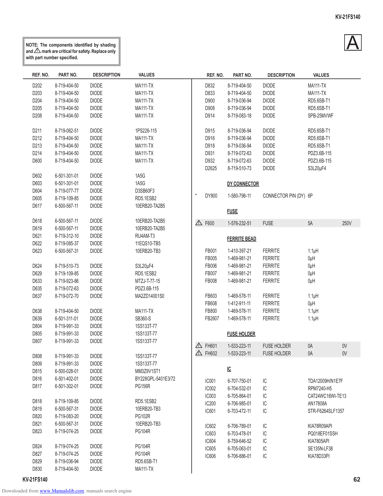

                                                                                                                                                      KV-21FS140

          NOTE: The components identified by shading
          and ! mark are critical for safety. Replace only
                                                                                                                                                           A
          with part number specified.

             REF. NO.      PART NO.          DESCRIPTION      VALUES                      REF. NO.        PART NO.        DESCRIPTION        VALUES

             D202        8-719-404-50       DIODE            MA111-TX                     D832       8-719-404-50    DIODE              MA111-TX
             D203        8-719-404-50       DIODE            MA111-TX                     D833       8-719-404-50    DIODE              MA111-TX
             D204        8-719-404-50       DIODE            MA111-TX                     D900       8-719-036-94    DIODE              RD5.6SB-T1
             D205        8-719-404-50       DIODE            MA111-TX                     D908       8-719-036-94    DIODE              RD5.6SB-T1
             D208        8-719-404-50       DIODE            MA111-TX                     D914       8-719-083-18    DIODE              SPB-25MVWF

             D211        8-719-062-51       DIODE            1PS226-115                   D915       8-719-036-94    DIODE              RD5.6SB-T1
             D212        8-719-404-50       DIODE            MA111-TX                     D916       8-719-036-94    DIODE              RD5.6SB-T1
             D213        8-719-404-50       DIODE            MA111-TX                     D918       8-719-036-94    DIODE              RD5.6SB-T1
             D214        8-719-404-50       DIODE            MA111-TX                     D931       8-719-072-63    DIODE              PDZ3.6B-115
             D600        8-719-404-50       DIODE            MA111-TX                     D932       8-719-072-63    DIODE              PDZ3.6B-115
                                                                                          D2625      8-719-510-73    DIODE              S3L20µF4
             D602        6-501-301-01       DIODE            1A5G
             D603        6-501-301-01       DIODE            1A5G                                    DY CONNECTOR
             D604        8-719-077-77       DIODE            D3SB60F3
             D605        8-719-109-85       DIODE            RD5.1ESB2            *       DY800      1-580-798-11    CONNECTOR PIN (DY) 6P
             D617        6-500-567-11       DIODE            10ERB20-TA2B5
                                                                                                     FUSE
             D618        6-500-567-11       DIODE            10ERB20-TA2B5            !   F600       1-576-232-51    FUSE               5A              250V
             D619        6-500-567-11       DIODE            10ERB20-TA2B5
             D621        8-719-312-10       DIODE            RU4AM-T3
                                                                                                     FERRITE BEAD
             D622        8-719-085-37       DIODE            11EQS10-TB5
             D623        6-500-567-31       DIODE            10ERB20-TB3                  FB001      1-410-397-21    FERRITE            1.1µH
                                                                                          FB005      1-469-981-21    FERRITE            0µH
             D624        8-719-510-73       DIODE            S3L20µF4                     FB006      1-469-981-21    FERRITE            0µH
             D629        8-719-109-85       DIODE            RD5.1ESB2                    FB007      1-469-981-21    FERRITE            0µH
             D633        8-719-923-86       DIODE            MTZJ-T-77-15                 FB008      1-469-981-21    FERRITE            0µH
             D635        8-719-072-63       DIODE            PDZ3.6B-115
             D637        8-719-072-70       DIODE            MA2ZD14001S0                 FB603      1-469-578-11    FERRITE            1.1µH
                                                                                          FB608      1-412-911-11    FERRITE            0µH
             D638        8-719-404-50       DIODE            MA111-TX                     FB800      1-469-578-11    FERRITE            1.1µH
             D639        6-501-311-01       DIODE            SB360-S                      FB2607     1-469-578-11    FERRITE            1.1µH
             D804        8-719-991-33       DIODE            1SS133T-77
             D805        8-719-991-33       DIODE            1SS133T-77                              FUSE HOLDER
             D807        8-719-991-33       DIODE            1SS133T-77
                                                                                      !   FH601      1-533-223-11    FUSE HOLDER        0A              0V
             D808        8-719-991-33       DIODE            1SS133T-77
                                                                                      !   FH602      1-533-223-11    FUSE HOLDER        0A              0V
             D809        8-719-991-33       DIODE            1SS133T-77
             D815        6-500-028-01       DIODE            MM3Z9V1ST1                              IC
             D816        6-501-402-01       DIODE            BY228GPL-5401E3/72           IC001      6-707-750-01    IC                 TDA12009H/N1E7F
             D817        6-501-302-01       DIODE            PG156R                       IC002      6-704-532-01    IC                 RPM7240-H5
                                                                                          IC003      6-705-864-01    IC                 CAT24WC16WI-TE13
             D818        8-719-109-85       DIODE            RD5.1ESB2                    IC200      6-706-985-01    IC                 AN17808A
             D819        6-500-567-31       DIODE            10ERB20-TB3                  IC601      6-703-472-11    IC                 STR-F6264SLF1357
             D820        8-719-083-20       DIODE            PG102R
             D821        6-500-567-31       DIODE            10ERB20-TB3                  IC602      6-706-789-01    IC                 KIA78R09API
             D823        8-719-074-25       DIODE            PG104R                       IC603      6-703-478-01    IC                 PQ018EF01SSH
                                                                                          IC604      8-759-646-52    IC                 KIA7805API
             D824        8-719-074-25       DIODE            PG104R                       IC605      6-705-063-01    IC                 SE135N-LF38
             D827        8-719-074-25       DIODE            PG104R                       IC606      6-706-886-01    IC                 KIA78D33PI
             D829        8-719-036-94       DIODE            RD5.6SB-T1
             D830        8-719-404-50       DIODE            MA111-TX
        KV-21FS140                                                                                                                                             62
Downloaded from www.Manualslib.com manuals search engine
