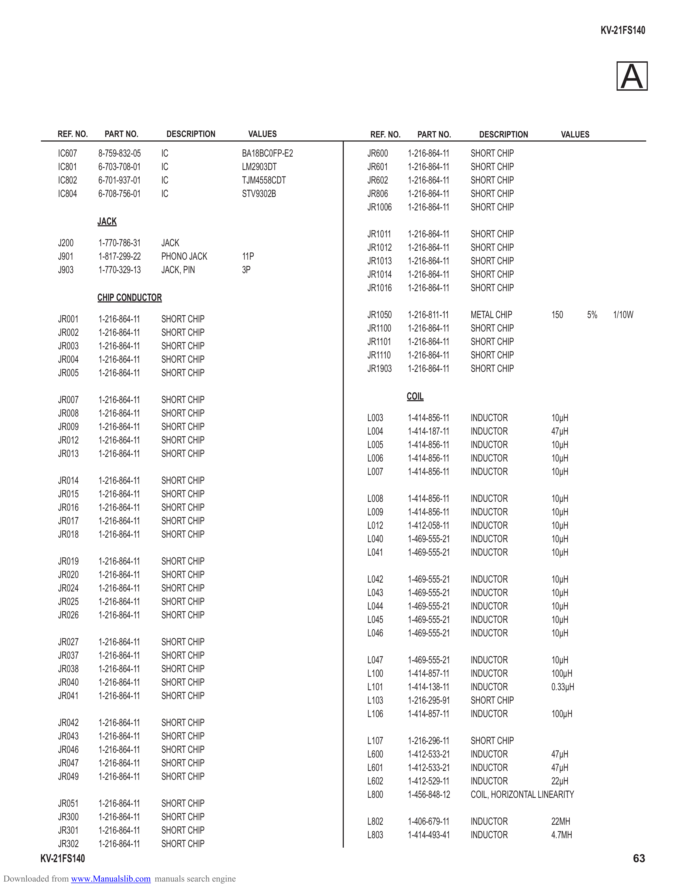

                                                                                                                                      KV-21FS140

                                                                                                                                          A
             REF. NO.    PART NO.        DESCRIPTION        VALUES        REF. NO.     PART NO.       DESCRIPTION         VALUES

             IC607      8-759-832-05   IC                  BA18BC0FP-E2   JR600      1-216-864-11   SHORT CHIP
             IC801      6-703-708-01   IC                  LM2903DT       JR601      1-216-864-11   SHORT CHIP
             IC802      6-701-937-01   IC                  TJM4558CDT     JR602      1-216-864-11   SHORT CHIP
             IC804      6-708-756-01   IC                  STV9302B       JR806      1-216-864-11   SHORT CHIP
                                                                          JR1006     1-216-864-11   SHORT CHIP
                        JACK
                                                                          JR1011     1-216-864-11   SHORT CHIP
             J200       1-770-786-31   JACK                               JR1012     1-216-864-11   SHORT CHIP
             J901       1-817-299-22   PHONO JACK          11P            JR1013     1-216-864-11   SHORT CHIP
             J903       1-770-329-13   JACK, PIN           3P             JR1014     1-216-864-11   SHORT CHIP
                                                                          JR1016     1-216-864-11   SHORT CHIP
                        CHIP CONDUCTOR

             JR001      1-216-864-11   SHORT CHIP                         JR1050     1-216-811-11   METAL CHIP          150      5%     1/10W
             JR002      1-216-864-11   SHORT CHIP                         JR1100     1-216-864-11   SHORT CHIP
             JR003      1-216-864-11   SHORT CHIP                         JR1101     1-216-864-11   SHORT CHIP
             JR004      1-216-864-11   SHORT CHIP                         JR1110     1-216-864-11   SHORT CHIP
             JR005      1-216-864-11   SHORT CHIP                         JR1903     1-216-864-11   SHORT CHIP

             JR007      1-216-864-11   SHORT CHIP                                    COIL
             JR008      1-216-864-11   SHORT CHIP                         L003       1-414-856-11   INDUCTOR            10µH
             JR009      1-216-864-11   SHORT CHIP                         L004       1-414-187-11   INDUCTOR            47µH
             JR012      1-216-864-11   SHORT CHIP                         L005       1-414-856-11   INDUCTOR            10µH
             JR013      1-216-864-11   SHORT CHIP                         L006       1-414-856-11   INDUCTOR            10µH
                                                                          L007       1-414-856-11   INDUCTOR            10µH
             JR014      1-216-864-11   SHORT CHIP
             JR015      1-216-864-11   SHORT CHIP                         L008       1-414-856-11   INDUCTOR            10µH
             JR016      1-216-864-11   SHORT CHIP                         L009       1-414-856-11   INDUCTOR            10µH
             JR017      1-216-864-11   SHORT CHIP                         L012       1-412-058-11   INDUCTOR            10µH
             JR018      1-216-864-11   SHORT CHIP                         L040       1-469-555-21   INDUCTOR            10µH
                                                                          L041       1-469-555-21   INDUCTOR            10µH
             JR019      1-216-864-11   SHORT CHIP
             JR020      1-216-864-11   SHORT CHIP                         L042       1-469-555-21   INDUCTOR            10µH
             JR024      1-216-864-11   SHORT CHIP                         L043       1-469-555-21   INDUCTOR            10µH
             JR025      1-216-864-11   SHORT CHIP                         L044       1-469-555-21   INDUCTOR            10µH
             JR026      1-216-864-11   SHORT CHIP                         L045       1-469-555-21   INDUCTOR            10µH
                                                                          L046       1-469-555-21   INDUCTOR            10µH
             JR027      1-216-864-11   SHORT CHIP
             JR037      1-216-864-11   SHORT CHIP                         L047       1-469-555-21   INDUCTOR            10µH
             JR038      1-216-864-11   SHORT CHIP                         L100       1-414-857-11   INDUCTOR            100µH
             JR040      1-216-864-11   SHORT CHIP                         L101       1-414-138-11   INDUCTOR            0.33µH
             JR041      1-216-864-11   SHORT CHIP                         L103       1-216-295-91   SHORT CHIP
                                                                          L106       1-414-857-11   INDUCTOR            100µH
             JR042      1-216-864-11   SHORT CHIP
             JR043      1-216-864-11   SHORT CHIP                         L107       1-216-296-11   SHORT CHIP
             JR046      1-216-864-11   SHORT CHIP                         L600       1-412-533-21   INDUCTOR             47µH
             JR047      1-216-864-11   SHORT CHIP                         L601       1-412-533-21   INDUCTOR             47µH
             JR049      1-216-864-11   SHORT CHIP                         L602       1-412-529-11   INDUCTOR             22µH
                                                                          L800       1-456-848-12   COIL, HORIZONTAL LINEARITY
             JR051      1-216-864-11   SHORT CHIP
             JR300      1-216-864-11   SHORT CHIP                         L802       1-406-679-11   INDUCTOR            22MH
             JR301      1-216-864-11   SHORT CHIP                         L803       1-414-493-41   INDUCTOR            4.7MH
             JR302      1-216-864-11   SHORT CHIP
        KV-21FS140                                                                                                                           63
Downloaded from www.Manualslib.com manuals search engine
