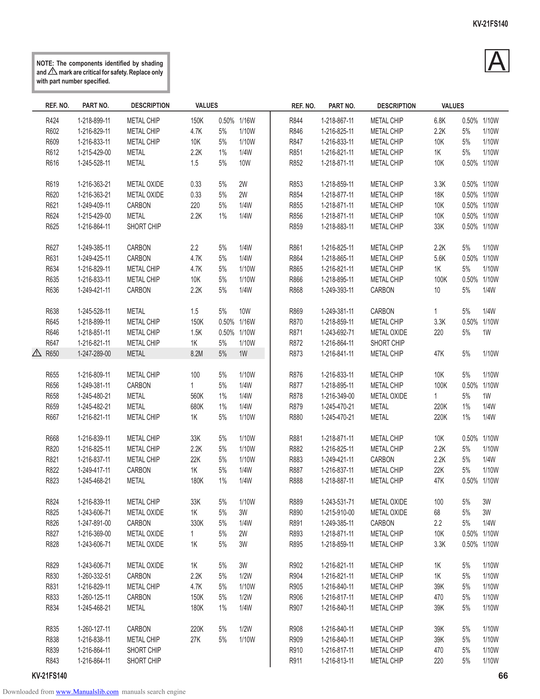

                                                                                                                                           KV-21FS140

          NOTE: The components identified by shading
          and ! mark are critical for safety. Replace only
          with part number specified.
                                                                                                                                               A
              REF. NO.     PART NO.          DESCRIPTION      VALUES                 REF. NO.     PART NO.       DESCRIPTION     VALUES

              R424       1-218-899-11       METAL CHIP       150K      0.50% 1/16W   R844       1-218-867-11   METAL CHIP      6.8K   0.50% 1/10W
              R602       1-216-829-11       METAL CHIP       4.7K      5%    1/10W   R846       1-216-825-11   METAL CHIP      2.2K   5%    1/10W
              R609       1-216-833-11       METAL CHIP       10K       5%    1/10W   R847       1-216-833-11   METAL CHIP      10K    5%    1/10W
              R612       1-215-429-00       METAL            2.2K      1%    1/4W    R851       1-216-821-11   METAL CHIP      1K     5%    1/10W
              R616       1-245-528-11       METAL            1.5       5%    10W     R852       1-218-871-11   METAL CHIP      10K    0.50% 1/10W

              R619       1-216-363-21       METAL OXIDE      0.33      5%    2W      R853       1-218-859-11   METAL CHIP      3.3K   0.50% 1/10W
              R620       1-216-363-21       METAL OXIDE      0.33      5%    2W      R854       1-218-877-11   METAL CHIP      18K    0.50% 1/10W
              R621       1-249-409-11       CARBON           220       5%    1/4W    R855       1-218-871-11   METAL CHIP      10K    0.50% 1/10W
              R624       1-215-429-00       METAL            2.2K      1%    1/4W    R856       1-218-871-11   METAL CHIP      10K    0.50% 1/10W
              R625       1-216-864-11       SHORT CHIP                               R859       1-218-883-11   METAL CHIP      33K    0.50% 1/10W

              R627       1-249-385-11       CARBON           2.2       5%    1/4W    R861       1-216-825-11   METAL CHIP      2.2K   5%    1/10W
              R631       1-249-425-11       CARBON           4.7K      5%    1/4W    R864       1-218-865-11   METAL CHIP      5.6K   0.50% 1/10W
              R634       1-216-829-11       METAL CHIP       4.7K      5%    1/10W   R865       1-216-821-11   METAL CHIP      1K     5%    1/10W
              R635       1-216-833-11       METAL CHIP       10K       5%    1/10W   R866       1-218-895-11   METAL CHIP      100K   0.50% 1/10W
              R636       1-249-421-11       CARBON           2.2K      5%    1/4W    R868       1-249-393-11   CARBON          10     5%    1/4W

              R638       1-245-528-11       METAL            1.5       5%    10W     R869       1-249-381-11   CARBON          1      5%    1/4W
              R645       1-218-899-11       METAL CHIP       150K      0.50% 1/16W   R870       1-218-859-11   METAL CHIP      3.3K   0.50% 1/10W
              R646       1-218-851-11       METAL CHIP       1.5K      0.50% 1/10W   R871       1-243-692-71   METAL OXIDE     220    5%    1W
              R647       1-216-821-11       METAL CHIP       1K        5%    1/10W   R872       1-216-864-11   SHORT CHIP
          !   R650       1-247-289-00       METAL            8.2M      5%    1W      R873       1-216-841-11   METAL CHIP      47K    5%     1/10W

              R655       1-216-809-11       METAL CHIP       100       5%    1/10W   R876       1-216-833-11   METAL CHIP      10K    5%    1/10W
              R656       1-249-381-11       CARBON           1         5%    1/4W    R877       1-218-895-11   METAL CHIP      100K   0.50% 1/10W
              R658       1-245-480-21       METAL            560K      1%    1/4W    R878       1-216-349-00   METAL OXIDE     1      5%    1W
              R659       1-245-482-21       METAL            680K      1%    1/4W    R879       1-245-470-21   METAL           220K   1%    1/4W
              R667       1-216-821-11       METAL CHIP       1K        5%    1/10W   R880       1-245-470-21   METAL           220K   1%    1/4W

              R668       1-216-839-11       METAL CHIP       33K       5%    1/10W   R881       1-218-871-11   METAL CHIP      10K    0.50% 1/10W
              R820       1-216-825-11       METAL CHIP       2.2K      5%    1/10W   R882       1-216-825-11   METAL CHIP      2.2K   5%    1/10W
              R821       1-216-837-11       METAL CHIP       22K       5%    1/10W   R883       1-249-421-11   CARBON          2.2K   5%    1/4W
              R822       1-249-417-11       CARBON           1K        5%    1/4W    R887       1-216-837-11   METAL CHIP      22K    5%    1/10W
              R823       1-245-468-21       METAL            180K      1%    1/4W    R888       1-218-887-11   METAL CHIP      47K    0.50% 1/10W

              R824       1-216-839-11       METAL CHIP       33K       5%    1/10W   R889       1-243-531-71   METAL OXIDE     100    5%    3W
              R825       1-243-606-71       METAL OXIDE      1K        5%    3W      R890       1-215-910-00   METAL OXIDE     68     5%    3W
              R826       1-247-891-00       CARBON           330K      5%    1/4W    R891       1-249-385-11   CARBON          2.2    5%    1/4W
              R827       1-216-369-00       METAL OXIDE      1         5%    2W      R893       1-218-871-11   METAL CHIP      10K    0.50% 1/10W
              R828       1-243-606-71       METAL OXIDE      1K        5%    3W      R895       1-218-859-11   METAL CHIP      3.3K   0.50% 1/10W

              R829       1-243-606-71       METAL OXIDE      1K        5%    3W      R902       1-216-821-11   METAL CHIP      1K     5%     1/10W
              R830       1-260-332-51       CARBON           2.2K      5%    1/2W    R904       1-216-821-11   METAL CHIP      1K     5%     1/10W
              R831       1-216-829-11       METAL CHIP       4.7K      5%    1/10W   R905       1-216-840-11   METAL CHIP      39K    5%     1/10W
              R833       1-260-125-11       CARBON           150K      5%    1/2W    R906       1-216-817-11   METAL CHIP      470    5%     1/10W
              R834       1-245-468-21       METAL            180K      1%    1/4W    R907       1-216-840-11   METAL CHIP      39K    5%     1/10W

              R835       1-260-127-11       CARBON           220K      5%    1/2W    R908       1-216-840-11   METAL CHIP      39K    5%     1/10W
              R838       1-216-838-11       METAL CHIP       27K       5%    1/10W   R909       1-216-840-11   METAL CHIP      39K    5%     1/10W
              R839       1-216-864-11       SHORT CHIP                               R910       1-216-817-11   METAL CHIP      470    5%     1/10W
              R843       1-216-864-11       SHORT CHIP                               R911       1-216-813-11   METAL CHIP      220    5%     1/10W
        KV-21FS140                                                                                                                                66
Downloaded from www.Manualslib.com manuals search engine
