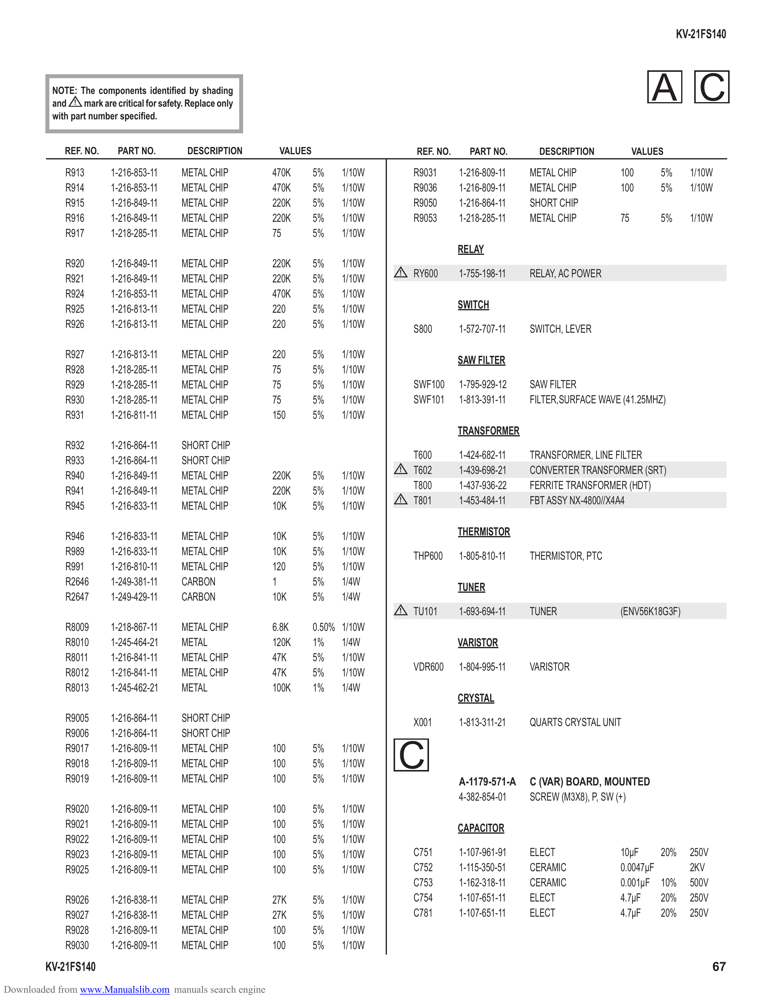

                                                                                                                                                      KV-21FS140

          NOTE: The components identified by shading
          and ! mark are critical for safety. Replace only
          with part number specified.
                                                                                                                                               A C
             REF. NO.      PART NO.          DESCRIPTION      VALUES                     REF. NO.     PART NO.       DESCRIPTION            VALUES

             R913        1-216-853-11       METAL CHIP       470K      5%    1/10W       R9031      1-216-809-11   METAL CHIP          100       5%     1/10W
             R914        1-216-853-11       METAL CHIP       470K      5%    1/10W       R9036      1-216-809-11   METAL CHIP          100       5%     1/10W
             R915        1-216-849-11       METAL CHIP       220K      5%    1/10W       R9050      1-216-864-11   SHORT CHIP
             R916        1-216-849-11       METAL CHIP       220K      5%    1/10W       R9053      1-218-285-11   METAL CHIP          75        5%     1/10W
             R917        1-218-285-11       METAL CHIP       75        5%    1/10W
                                                                                                    RELAY
             R920        1-216-849-11       METAL CHIP       220K      5%    1/10W
             R921        1-216-849-11       METAL CHIP       220K      5%    1/10W
                                                                                     !   RY600      1-755-198-11   RELAY, AC POWER
             R924        1-216-853-11       METAL CHIP       470K      5%    1/10W
             R925        1-216-813-11       METAL CHIP       220       5%    1/10W                  SWITCH
             R926        1-216-813-11       METAL CHIP       220       5%    1/10W       S800       1-572-707-11   SWITCH, LEVER

             R927        1-216-813-11       METAL CHIP       220       5%    1/10W
                                                                                                    SAW FILTER
             R928        1-218-285-11       METAL CHIP       75        5%    1/10W
             R929        1-218-285-11       METAL CHIP       75        5%    1/10W       SWF100     1-795-929-12   SAW FILTER
             R930        1-218-285-11       METAL CHIP       75        5%    1/10W       SWF101     1-813-391-11   FILTER,SURFACE WAVE (41.25MHZ)
             R931        1-216-811-11       METAL CHIP       150       5%    1/10W
                                                                                                    TRANSFORMER
             R932        1-216-864-11       SHORT CHIP
             R933        1-216-864-11       SHORT CHIP                                   T600       1-424-682-11   TRANSFORMER, LINE FILTER
             R940        1-216-849-11       METAL CHIP       220K      5%    1/10W
                                                                                     !   T602       1-439-698-21   CONVERTER TRANSFORMER (SRT)
             R941        1-216-849-11       METAL CHIP       220K      5%    1/10W       T800       1-437-936-22   FERRITE TRANSFORMER (HDT)
             R945        1-216-833-11       METAL CHIP       10K       5%    1/10W
                                                                                     !   T801       1-453-484-11   FBT ASSY NX-4800//X4A4

             R946        1-216-833-11       METAL CHIP       10K       5%    1/10W                  THERMISTOR
             R989        1-216-833-11       METAL CHIP       10K       5%    1/10W       THP600     1-805-810-11   THERMISTOR, PTC
             R991        1-216-810-11       METAL CHIP       120       5%    1/10W
             R2646       1-249-381-11       CARBON           1         5%    1/4W                   TUNER
             R2647       1-249-429-11       CARBON           10K       5%    1/4W
                                                                                     !   TU101      1-693-694-11   TUNER               (ENV56K18G3F)
             R8009       1-218-867-11       METAL CHIP       6.8K      0.50% 1/10W
             R8010       1-245-464-21       METAL            120K      1%    1/4W                   VARISTOR
             R8011       1-216-841-11       METAL CHIP       47K       5%    1/10W
                                                                                         VDR600     1-804-995-11   VARISTOR
             R8012       1-216-841-11       METAL CHIP       47K       5%    1/10W
             R8013       1-245-462-21       METAL            100K      1%    1/4W
                                                                                                    CRYSTAL
             R9005       1-216-864-11       SHORT CHIP                                   X001       1-813-311-21   QUARTS CRYSTAL UNIT
             R9006       1-216-864-11       SHORT CHIP
             R9017
             R9018
             R9019
                         1-216-809-11
                         1-216-809-11
                         1-216-809-11
                                            METAL CHIP
                                            METAL CHIP
                                            METAL CHIP
                                                             100
                                                             100
                                                             100
                                                                       5%
                                                                       5%
                                                                       5%
                                                                             1/10W
                                                                             1/10W
                                                                             1/10W
                                                                                     C              A-1179-571-A   C (VAR) BOARD, MOUNTED
                                                                                                    4-382-854-01   SCREW (M3X8), P, SW (+)
             R9020       1-216-809-11       METAL CHIP       100       5%    1/10W
             R9021       1-216-809-11       METAL CHIP       100       5%    1/10W                  CAPACITOR
             R9022       1-216-809-11       METAL CHIP       100       5%    1/10W
             R9023       1-216-809-11       METAL CHIP       100       5%    1/10W       C751       1-107-961-91   ELECT               10µF     20%     250V
             R9025       1-216-809-11       METAL CHIP       100       5%    1/10W       C752       1-115-350-51   CERAMIC             0.0047µF         2KV
                                                                                         C753       1-162-318-11   CERAMIC             0.001µF 10%      500V
             R9026       1-216-838-11       METAL CHIP       27K       5%    1/10W       C754       1-107-651-11   ELECT               4.7µF    20%     250V
             R9027       1-216-838-11       METAL CHIP       27K       5%    1/10W       C781       1-107-651-11   ELECT               4.7µF    20%     250V
             R9028       1-216-809-11       METAL CHIP       100       5%    1/10W
             R9030       1-216-809-11       METAL CHIP       100       5%    1/10W
        KV-21FS140                                                                                                                                             67
Downloaded from www.Manualslib.com manuals search engine
